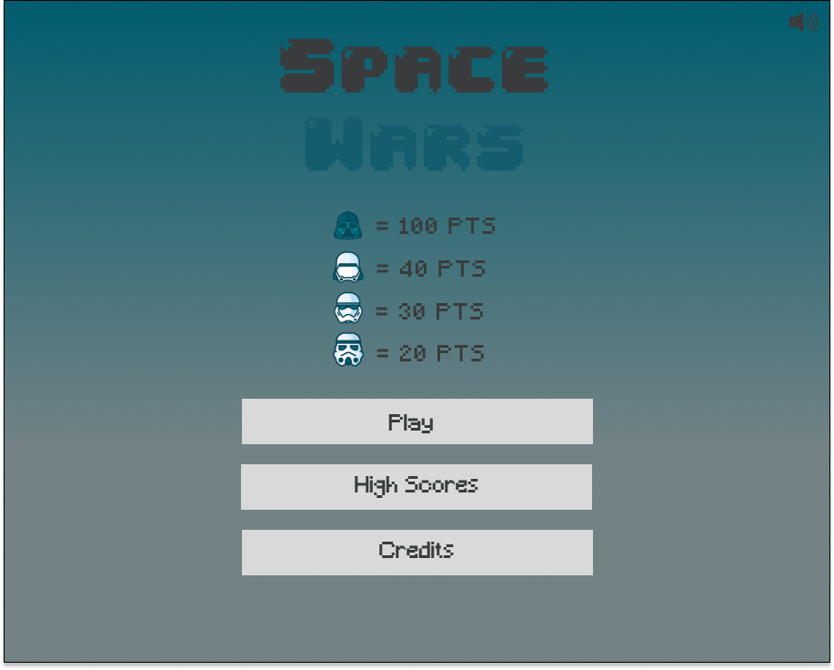
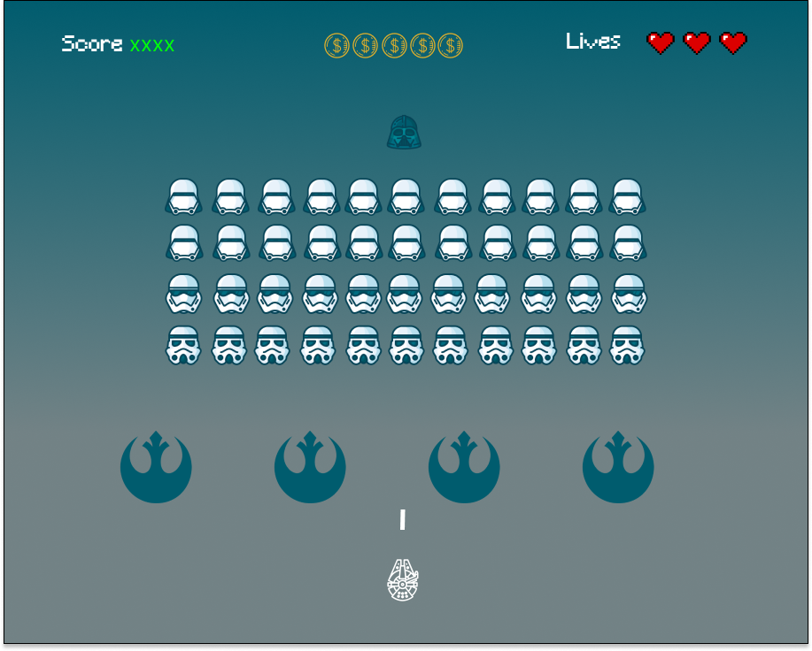
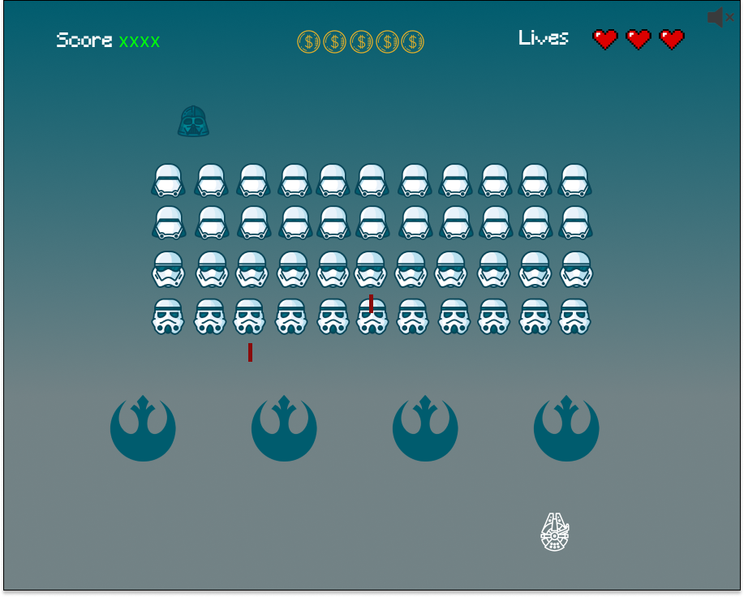
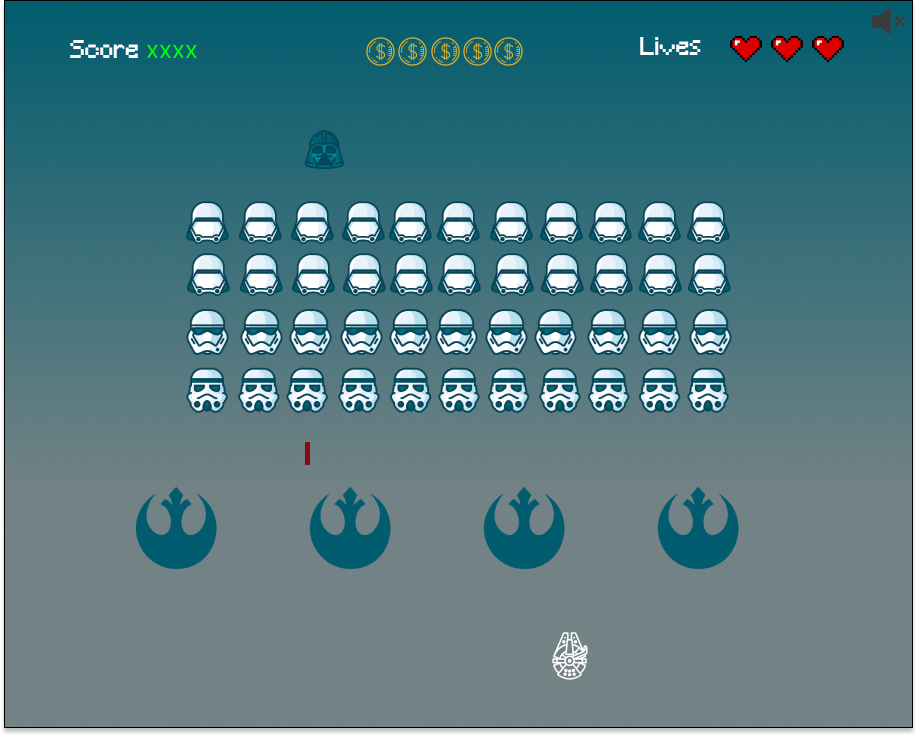
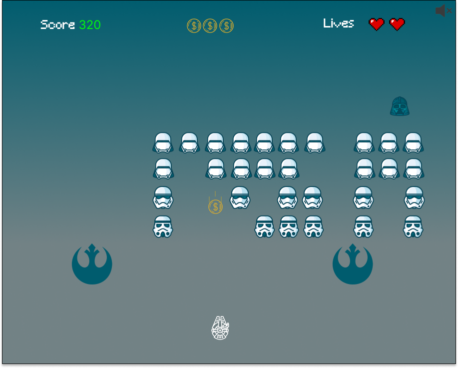
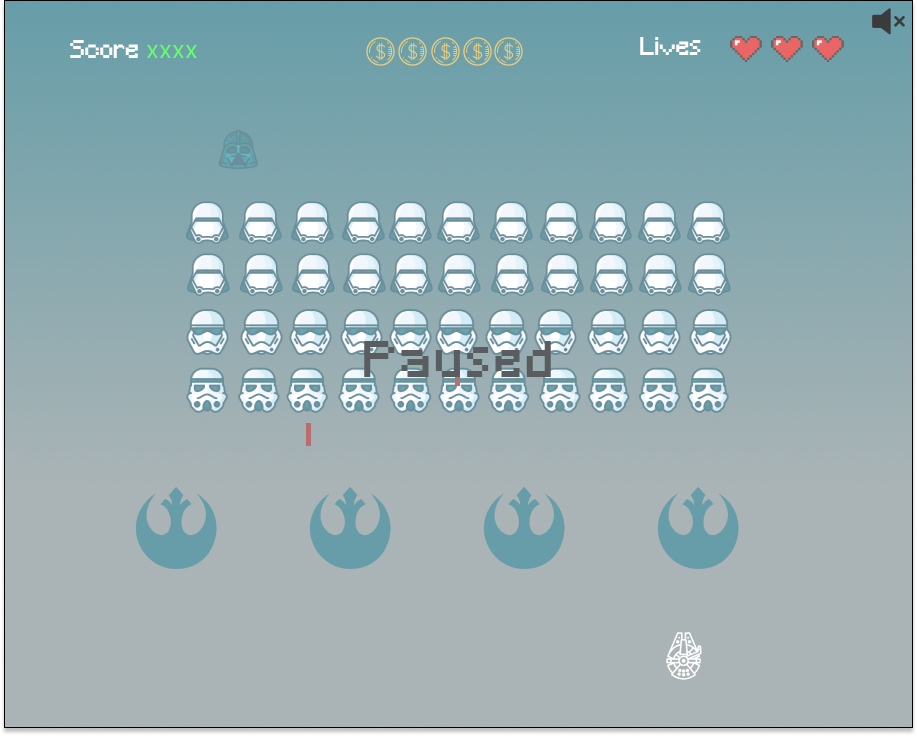
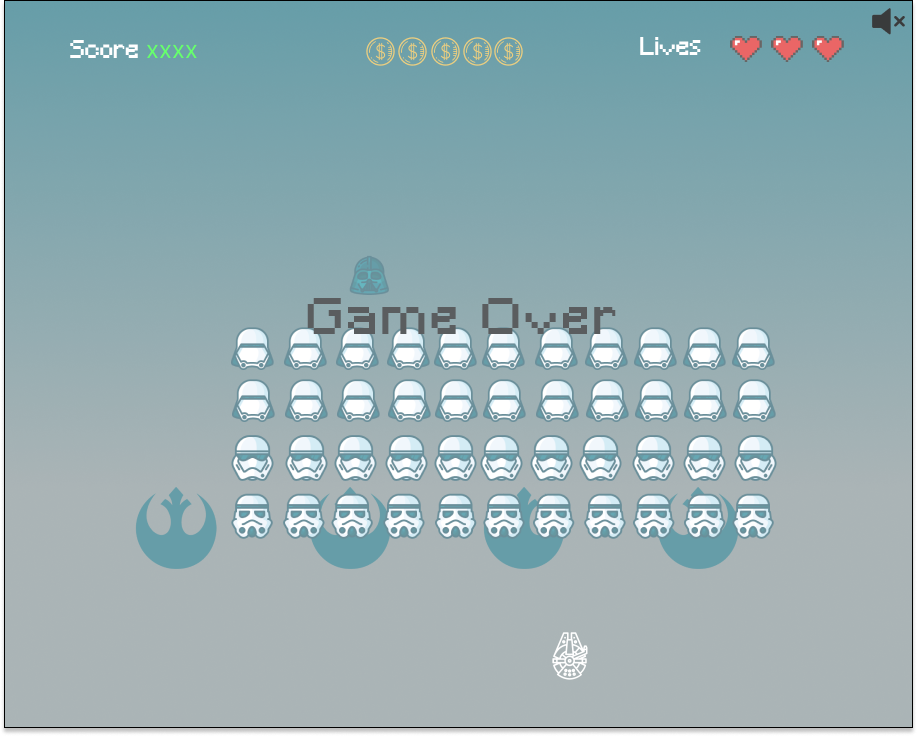
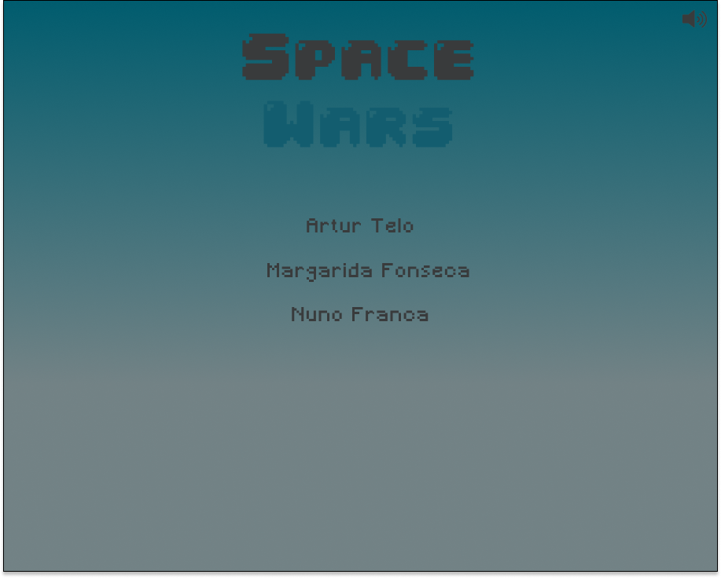
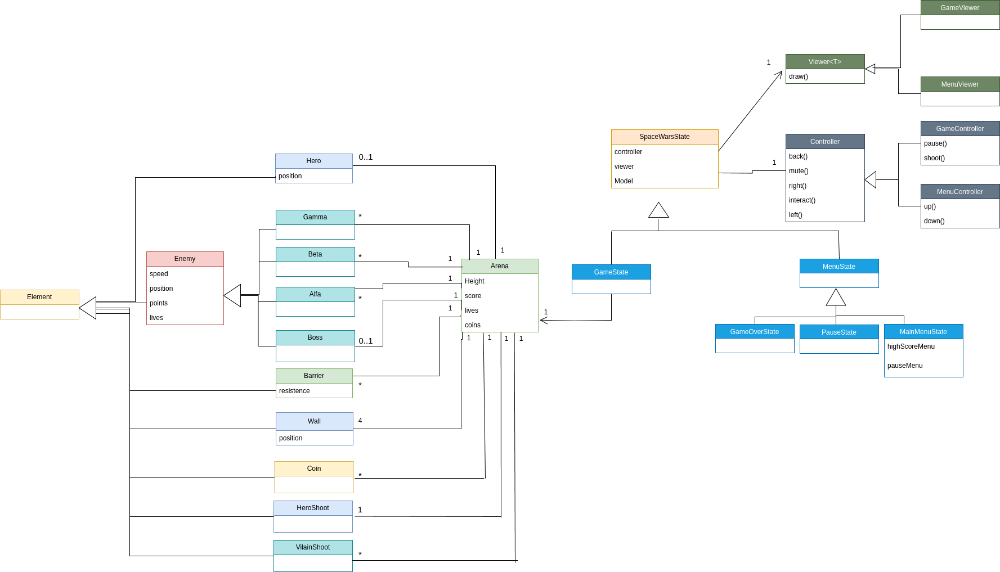

## LDTS_T09G04 - SPACE WARS

In this next-gen 2D game, you will be able to play a reimagined space invaders game, you will be able to play solo or local co-op, when playing local co-op both players will share the same screen and keyboard! There will be a lot of different enemies with different characteristics and therefore different difficulty.

This project was developed by *Artur Telo* (*up202104487@fe.up.pt*), *Margarida Fonseca* (*up202207742@fe.up.pt*) and *Nuno França* (*up2018075530@fe.up.pt*) for LDTS 2023/2024.

### Mockups

*
Fig1. Menu
*

*
Fig2. Gameplay
*

*
Fig3. Gameplay with two enemy shots
*

*
Fig4. Gameplay with enemies and hero movement
*

*
Fig5. Gameplay with some enemies killed and a coin dropping
*

*
Fig6. Paused game
*

*
Fig7. Game Over
*

*
Fig8. Credits
*

### UML Diagram

*
Fig9. UML
*

### IMPLEMENTED FEATURES

> This section should contain a list of implemented features and their descriptions. In the end of the section, include two or three screenshots that illustrate the most important features.

### PLANNED FEATURES

1. **Player Spaceship:**
   - A controllable spaceship at the bottom of the screen that can move horizontally to evade enemy attacks.
  
2. **Enemy Invaders:**
   - Rows of alien invaders that move horizontally and descend towards the player. They fire projectiles at the player's spaceship.

3. **Player Shooting:**
   - The player can shoot projectiles towards the enemy invaders to destroy them.

4. **Enemy Movement:**
   - The enemy invaders move left and right in a coordinated pattern. As they reach the screen edges, they descend one row.

5. **Collision Detection:**
   - Check for collisions between player shots and enemy invaders. If a collision occurs, the corresponding enemy invader is destroyed.

6. **Score System:**
   - Keep track of the player's score, which increases each time an enemy invader is successfully destroyed.

7. **Infinite Level:**
   - Implement an infinite level and as the player progresses and as the time goes by, the speed, health and aggression of the enemy invaders increases and more enemies keep appearing.

8. **Game Over:**
   - Implement a game-over condition. The game ends when the player's spaceship is hit by an enemy projectile and loses all its lives or when the enemy invaders reach the bottom of the screen.

9. **Sound Effects:**
   - Add sound effects for actions such as shooting, enemy destruction, and game over to enhance the gaming experience.

10. **Graphics and Animation:**
    - Use graphics to represent the player's spaceship, enemy invaders, and projectiles. Implement animations for movements and explosions.

11. **Responsive Controls:**
    - Ensure smooth and responsive controls for the player's spaceship, allowing easy navigation and shooting.

12. **Power-ups:**
    - Include 4 power-ups that provide temporary benefits to the player, such as increased damage on the player shots, invincibility for 20 seconds, double the player speed and double the player shots speed.

13. **High Score Tracking:**
    - Keep track of the player's highest score across multiple game sessions.

14. **Pause/Resume Functionality:**
    - Allow the player to pause the game and resume from the same state.

15. **Game Instructions:**
    - Provide clear instructions or a tutorial on how to play the game.

16. **Game Menu:**
    - Create a visually appealing game window with a clear display of the player's score, remaining lives, and other relevant information.

These features collectively contribute to an engaging and enjoyable Space Invasors gaming experience.

### DESIGN

#### Design patterns

For the implementation of our game, we went with three different design patterns:

- **State Pattern** - Which allows to differentiate between the two principle states, game state and menu state

- **Composite** - Which is a great way to englobe all the different types of enemies that are present in the game.

- **MVC** - Also known as the Model View Controller Architectural Pattern, this pattern allows to aggregate the game logic and connect the view of the game with all the data/logic and how the inputs are processed.

#### THE PLAYER INPUTS SHOULD BEHAVE DIFFERENTLY DEPENDING IF ITS ON MENU STATE OR GAME STATE

**Problem in Context**

Not having different states for the menu and game creates a lot of conditional logic, where either the player is on the menu or actually playing the game, which violates principles regarding good code.

**The Pattern**

We then applied the State pattern. This patern allows us to represent different states for different interactions. With this pattern we can then switch to a different state depending on the interaction, eliminating the problems associated with unecessary conditional logic.

**Implementation**

The UML Diagram shows how the pattern is currently implemented.

**TODO** Implementation in code.

**Consequences**

The use of the State Pattern in the current design allows the following benefits:

- Different states for different implementations.
- Reducing the clutter created by unecessary conditonals.

#### THE DIFFERENT TYPES OF ENEMIES SHOULD BE COMPOSED INTO MORE COMPLEX AND GLOBAL ENEMY

**Problem in Context**

Not having a general class for Enemy, creates an exaggerated and unecessary amount of classes one for each enemy and violates the Open-Closed Principle.

**The Pattern**

In order to change that, we applied the Composite Pattern, which allows us to represent part-whole hierarchies of objects.

**Implementation**

The UML Diagram shows how the pattern is currently implemented.

**TODO** Implementation in code.

**Consequences**

The use of the Composite Pattern in the current design allows the following benefits:

- Clients can be kept simple.
- In case we want to add more different types of enemies, it'll be easier.
- Primitive enemies can be composed into a Enemy more complex.

#### KNOWN CODE SMELLS

Currently there are no known code smells.

### THERE SHOULD BE A SEPARATION BETWEEN THE VIEW, MODEL AND CONTROLLER 

**Problem in Context**

Not having a separation between the View, Model and Controller, violates almost every good practice of good coding. Since we want to differentiate how the data is repesented, to how the display of data happens and how the inputs of the user are interpreted.

**The Pattern**

In order to change that, we applied the MVC Pattern, where the model only represents de data. The View will display the model data and sends actions for the user to interpret. Finally the controller provides new model data to the view and interprets new user actions.

**Implementation**

The UML Diagram shows how the pattern is currently implemented.

**TODO** Implementation in code.

**Consequences**

The use of the MVC Pattern in the current design allows the following benefits:

- Encourages code reuse by isolating the business logic.
- Facilitates unit testing as each component.
- Supports scalability by allowing each component to evolve independently.

#### KNOWN CODE SMELLS

Currently there are no known code smells.

### TESTING

- Screenshot of coverage report.
- Link to mutation testing report.

### SELF-EVALUATION

- Artur Telo: 33.3(3)%
- Margarida Fonseca: 33.3(3)%
- Nuno França: 33.3(3)%
