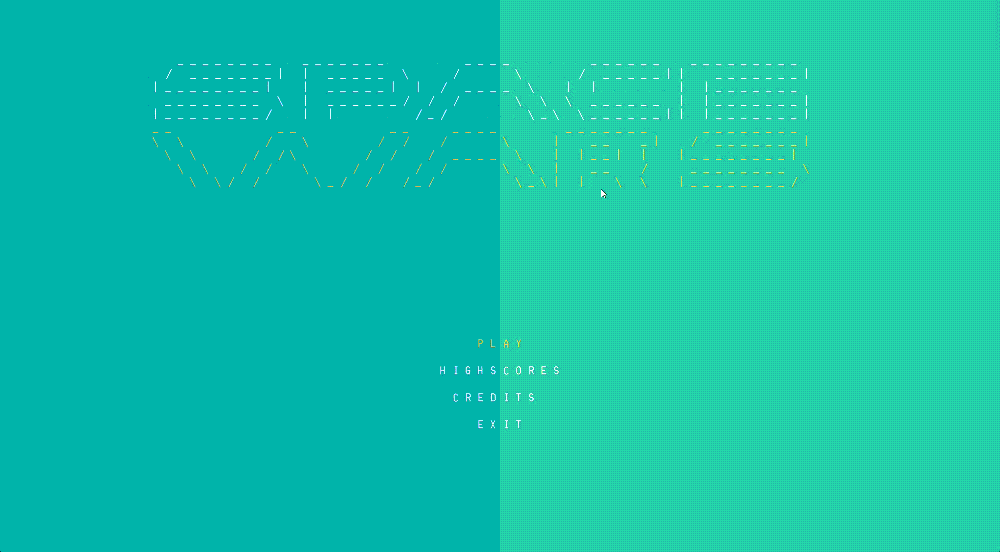
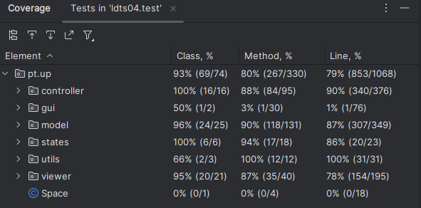

# LDTS_T09G04 - SPACE WARS

[![jdk][openjdk-image]][openjdk-url]

In this next-gen 2D game, you will be able to play a reimagined Space Invaders. A single player game were you can save the world against the Tyranny of the Empire. There will be a lot of different enemies with different characteristics that you can destroy, this allows for a dynamic and engaging gameplay, where different players can go against each other to see who achieves the highest score!

This project was developed by *Artur Telo* (*up202104487@fe.up.pt*), *Margarida Fonseca* (*up202207742@fe.up.pt*) and *Nuno França* (*up2018075530@fe.up.pt*) for LDTS 2023/2024.

## Final Game

## Game Over

## Mockups

*
Fig1. Menu
*

*
Fig2. Gameplay
*

*
Fig3. Gameplay with two enemy shots
*

*
Fig4. Gameplay with enemies and hero movement
*

*
Fig5. Gameplay with some enemies killed and a coin dropping
*

*
Fig6. Paused game
*

*
Fig7. Game Over
*

*
Fig8. Credits
*

## UML Diagram

*
Fig9. UML
*

## IMPLEMENTED FEATURES

1. **Player Spaceship:**
   - A controllable spaceship at the bottom of the screen that can move horizontally to evade enemy attacks.

2. **Enemy Invaders:**
   - Rows of enemys that move horizontally and descend towards the player. They fire projectiles at the player's spaceship.
   - There is also a Boss that move back an forth with higher speed, the score of this enemy is higher than the others. 

3. **Player Shooting:**
   - The player can shoot projectiles towards the enemy invaders to destroy them.

4. **Enemy Movement:**
   - The enemy invaders move left and right in a coordinated pattern. As they reach the screen edges, they descend one row. Except for the Boss Enemy.

5. **Collision Detection:**
   - Check for collisions between player shots and enemy invaders. If a collision occurs, the corresponding enemy invader is destroyed.

6. **Score System:**
   - Keep track of the player's score, which increases each time an enemy invader is successfully destroyed.

8. **Game Over:**
   - Implement a game-over condition. The game ends when the player's spaceship is hit by an enemy projectile and loses all its lives or all the enemies are destroyed by the player.

10. **Graphics and Animation:**
    - Use graphics to represent the player's spaceship, enemy invaders, and projectiles. Implement animations for movements.

11. **Responsive Controls:**
    - Ensure smooth and responsive controls for the player's spaceship, allowing easy navigation and shooting.

13. **High Score Tracking:**
    - Keep track of the player's highest score across multiple game sessions.

16. **Game Menu:**
    - Create a visually appealing game window with a clear display of the player's score, remaining lives, and other relevant information.

## PLANNED FEATURES

Alas not all features that were planned in the sprint0 of the project were able to be implemented in time for the final delivery, so this section will remain to show all the other ideas that would 

7. **Infinite Level:**
   - Implement an infinite level and as the player progresses and as the time goes by, the speed, health and aggression of the enemy invaders increases and more enemies keep appearing.

9. **Sound Effects:**
   - Add sound effects for actions such as shooting, enemy destruction, and game over to enhance the gaming experience.

12. **Power-ups:**
    - Include 4 power-ups that provide temporary benefits to the player, such as increased damage on the player shots, invincibility for 20 seconds, double the player speed and double the player shots speed.

14. **Pause/Resume Functionality:**
    - Allow the player to pause the game and resume from the same state.

15. **Game Instructions:**
    - Provide clear instructions or a tutorial on how to play the game.

## DESIGN

### Design patterns

For the implementation of our game, we went with three different design patterns:

- **State Pattern** - Which allows to differentiate between the two principle states, game state and menu state

- **Composite** - Which is a great way to englobe all the different types of enemies that are present in the game.

- **MVC** - Also known as the Model View Controller Architectural Pattern, this pattern allows to aggregate the game logic and connect the view of the game with all the data/logic and how the inputs are processed.

#### THE PLAYER INPUTS SHOULD BEHAVE DIFFERENTLY DEPENDING IF ITS ON MENU STATE OR GAME STATE

**Problem in Context**

Not having different states for the menu and game creates a lot of conditional logic, where either the player is on the menu or actually playing the game, which violates principles regarding good code.

**The Pattern**

We then applied the State pattern. This pattern allows us to represent different states for different interactions. With this pattern we can then switch to a different state depending on the interaction, eliminating the problems associated with unecessary conditional logic.

**Implementation**

The UML Diagram shows how the pattern is currently implemented.

**Consequences**

The use of the State Pattern in the current design allows the following benefits:

- Different states for different implementations.
- Reducing the clutter created by unnecessary conditionals.

### THE DIFFERENT TYPES OF ENEMIES SHOULD BE COMPOSED INTO MORE COMPLEX AND GLOBAL ENEMY

**Problem in Context**

Not having a general class for Enemy, creates an exaggerated and unnecessary amount of classes one for each enemy and violates the Open-Closed Principle.

**The Pattern**

In order to change that, we applied the Composite Pattern, which allows us to represent part-whole hierarchies of objects.

**Implementation**

The UML Diagram shows how the pattern is currently implemented.

**Consequences**

The use of the Composite Pattern in the current design allows the following benefits:

- Clients can be kept simple.
- In case we want to add more different types of enemies, it'll be easier.
- Primitive enemies can be composed into a Enemy more complex.

### KNOWN CODE SMELLS

Currently there are no known code smells.

**Problem in Context**

Not having a separation between the View, Model and Controller, violates almost every good practice of good coding. Since we want to differentiate how the data is repesented, to how the display of data happens and how the inputs of the user are interpreted.

**The Pattern**

In order to change that, we applied the MVC Pattern, where the model only represents de data. The View will display the model data and sends actions for the user to interpret. Finally the controller provides new model data to the view and interprets new user actions.

**Implementation**

The UML Diagram shows how the pattern is currently implemented.

**Consequences**

The use of the MVC Pattern in the current design allows the following benefits:

- Encourages code reuse by isolating the business logic.
- Facilitates unit testing as each component.
- Supports scalability by allowing each component to evolve independently.

## KNOWN CODE SMELLS

While doing the project some generic classes were created that would be useful for the implementation of all the planned features, but with the progress of time, some features were not implemented. Which turned the classes into dead code.
We reckon that there are some classes where the Single Responsibility Principle is violated as well.

### TESTING

#### Coverage Tests

#### Mutation Tests
- There was a technical difficulty in the procedure of running Mutation Tests. 

### SELF-EVALUATION

- Artur Telo: 33.3(3)%
- Margarida Fonseca: 33.3(3)%
- Nuno França: 33.3(3)%

[openjdk-image]: https://img.shields.io/badge/OpenJDK-21.0.1-blue
[openjdk-url]: https://www.oracle.com/java/technologies/javase/21-0-1-relnotes.html
